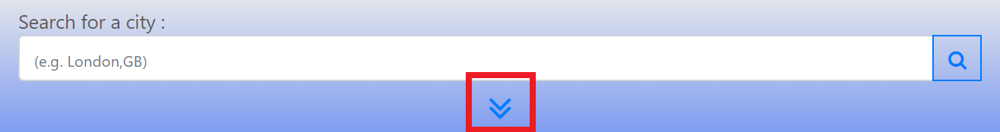
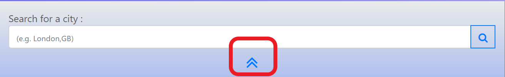
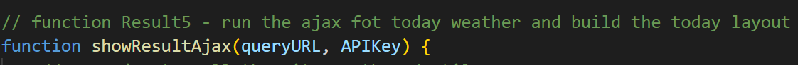

# Project Name

Homework 6 - Weather Dashboard

# Table of contents

- [Project Name](#project-name)
- [Table of contents](#table-of-contents)
- [General info](#general-info)
- [Screenshots](#screenshots)
- [Features](#features)
- [Code Style](#code-style)
  - [<span style="color: rgb(220, 105, 1);"> Description for the code</span>](#description-for-the-code)
- [Technology](#technology)
- [Local File Description](#local-file-description)
- [Code Example](#code-example)
- [Test](#test)
- [Status](#status)
- [Future Plan](#future-plan)
- [Create By](#create-by)

# General info

This project is to bulid a weather dashboard where allow the user to check with the weather of different location when the user need to travel to different places around the world.

Apart from the same day weather infomraton, the user can obtain a five days weather forcast for any cities around the world.

- All the weather infomation provided by [OpenWeather](https://openweathermap.org/)

Please visit [https://rickyfuk.github.io/uwbootscamphomework6/](https://rickyfuk.github.io/uwbootscamphomework6/) for the site.

For the feature of the site, please visit the [Features](#features) section for more details.

# Screenshots


# Features

In this project, the following features have apply to the site:

1. Favicon have been added for the page
2. The user can enter any city name and press the searh button to look for the weather for that city
3. The weather information include the same day weather and a five days forcast. the table below will show the list of the infomation included for each area:
   | Infomation | Same Day Weather | 5 Days Forcast |
   | :----------: | :--------------------------------: | :----------: |
   | City Name | Yes | No |
   | Date | Yes | Yes |
   | Weather Icon | Yes | Yes |
   | Temperture | Yes | Yes |
   | Feel Like Temperture | Yes | No |
   | Humidity | Yes | Yes |
   | Wind Speed | Yes | No |
   | UV index\*^ | Yes | No |
   - \*Note: UV Color Indicator will determine by the rounded UV index.
   - ^Note: UV Index will include a color background for an indicator and the color scale is refer to the standard of [World Health Organization](https://www.who.int/).Please refer to the details as below:
     | UV INDEX | Level | Color indicator |
     | :----------: | :--------------------------------: | :----------: |
     | 0-2 | Low | Green - rgb(62, 167, 45) |
     | 3-5 | Medium | Yellow - rgb(255, 243, 0) |
     | 6-7 | High | Orange - rgb(241, 139, 0) |
     | 8-10 | Very High | Red - rgb(229, 50, 16)|
     | 11+ | Extreme| Violet - rgb(181, 103, 164) |
4. The default dashboard will show the weather of the city where the user located in.
5. The user can choose a city from the recent search result by clicking the cities name in the list
   - Only last 15 cities record will be shown on the list
   - The weather infomration for the last seen city will go to the top of the list
6. For the mobile user, the recent search list will not shown until the following condition take place
   1. At least one city have been searched
   2. The users click the down arrow (The user can always click the up arrow to hide the list)
      - Down Arrow Sample 
      - Up Arrow Sample 
   3. The users click the input box for the searching a new the city
      - The list will hide if the box is not being focus anymore

# Code Style

Standard

## <span style="color: rgb(220, 105, 1);"> Description for the code</span>

A general description for the every section on the top of the code to breifly explain the puopose of that section and some note for the section details.

  <div>
  
   *example for the section description*
  </div>

For easier reference, the location of the function will place inside its description


# Technology

The following technology have been used for this project:

1. [HTML](https://whatwg.org/)
2. [CSS](https://www.w3.org/Style/CSS/)
3. [Bootstrap](https://getbootstrap.com/)
4. [Fontawesome](https://fontawesome.com/)
5. [JavaScript](https://www.javascript.com/)
6. [JQUERY](https://jquery.com/)
7. [JSON](https://www.json.org/json-en.html)
8. [AJAX](https://developer.mozilla.org/en-US/docs/Web/Guide/AJAX)
9. [API](https://en.wikipedia.org/wiki/Application_programming_interface)
   1. [Openweather](https://openweathermap.org/api)

# Local File Description

Below are the description for all local files:

1. HTML:
   1. index.html - The main structure for the application
2. CSS:
   1. reset.css - to reset all the styling setting
   2. style.css - to add the local style to this application
3. JavaScript
   1. main.js - the main javascript for the eventlisten setup on the main framework
   2. result.js - the javascript for loading the "Today weather" data into the application and bulid the layout for "Today" section
   3. forcast.js - the javascript for loading the"Forcast weather" data into the application and bulid the layout for the "Forcast" section
   4. searchRecord.js - the javascript for displaying the previous search record on the Recent Search list.

# Code Example

Below are some example for the code has been used and the corresponding outcome:

1. To activiate the datepicker
   ```Javascript
           	// add the datepicker for the date selection
               $('#datepicker').datepicker({
                   changeMonth: true,
                   changeYear: true,
               });
   ```
2. To add the datepicker function, the following link and script files are required

   ```html
   <!-- jquery UI CSS for "DatePicker" -->
   > > > > >
   ```

3. To avoid the overloading for the array to save the data, the date has been added for the key name when the data is saving into the local stroage
   ```Javascript
       // for saving the data into the local stroage
       localStorage.setItem(
   		'dayplannerDataArray' + selectDateSave,
   		JSON.stringify(saveDataArrayFinal)
       );
       // for loading the date from the local stroage
       var storedResult = JSON.parse(
   		localStorage.getItem('dayplannerDataArray' + selectDateSave)
   	);
   ```
4. To avoid the overloading for the array to save the data, the following scripts added to remove the duplicated hours object where it had been save before
   ```Javascript
       // remove the duplicated data record
   	// (i.e.) if original textcontent for Jul-1-2020 3pm is ABC =>
   	// 		  and now the user input CBA =>
   	//        then CBA will replace ABC and the ABC object will remove from the array
   	// the purpose is to reduce the size of the array when the user repeat input a lot of times
   	// to do that we need the following 5 steps:
   	// 1. set up a temp arr
   	var temparr = saveDataArray.map(function (a) {
   		return a.saveDataHour;
   	});
   	// 2. find the dup item
   	var findDup = function (arr) {
   		let dups = [];
   		let compare = [];
   		for (a = 0; a < arr.length; a++) {
   			if (compare.includes(arr[a])) {
   				dups.push(arr[a]);
   			} else {
   				compare.push(arr[a]);
   				console.log(compare);
   			}
   		}
   		return compare;
   	};
   	// 3. find the last index for the dup item
   	var lastIndex = function (arr1, arr2) {
   		let lastIndexArr = [];
   		for (b = 0; b < arr2.length; b++) {
   			let num = arr1.lastIndexOf(arr2[b]);
   			lastIndexArr.push(num);
   		}
   		return lastIndexArr;
   	};
   	// 4. only get the last time to the final array
   	var removeDup = function (arr1, arr2) {
   		let finalResult = [];
   		for (c = 0; c < arr2.length; c++) {
   			finalResult.push(arr1[arr2[c]]);
   		}
   		return finalResult;
   	};
   	// 5. return the final result for saving
   	saveDataArrayFinal = removeDup(
   		saveDataArray,
   		lastIndex(temparr, findDup(temparr))
   	);
   ```
5. In order to make the date selection works, the page will reload after the user press "Go" button and the date will save into the session stroage. Below is an example for storing the select date in session stroage

   ```Javascript
      // saving the select date to session stroage
      $('#selectDateBtn').on('click', function () {
          event.preventDefault();
          // store the new date in the selectDate
          sessionStorage.setItem('changeDate', JSON.stringify(selectDate));
          // reload the page
          location.reload(true);
      });

      // load the select date from session stroage
      function loadFromDateSessionStroage() {
          var storedDateResult = JSON.parse(sessionStorage.getItem('changeDate'));
          if (storedDateResult !== null) {
              selectDate = storedDateResult;
          }
      }
   ```

# Test

1. The site have been tested by open with small/medium/large device respectively.
2. The site have been tested by a HTML validation service - [W3C](https://validator.w3.org/)

# Status

Project status: finished

# Future Plan

Plan for the future development of this site:

1. The user can click the different data box and the details weather data for that day will show up on the main box.
2. Set up an option page for the user to choose the parameter (e.g. wind speed - MPH/Knt)
3. Connect more API with the location (e.g. news/yelp)

# Create By

Created by Chung Hei Fuk
